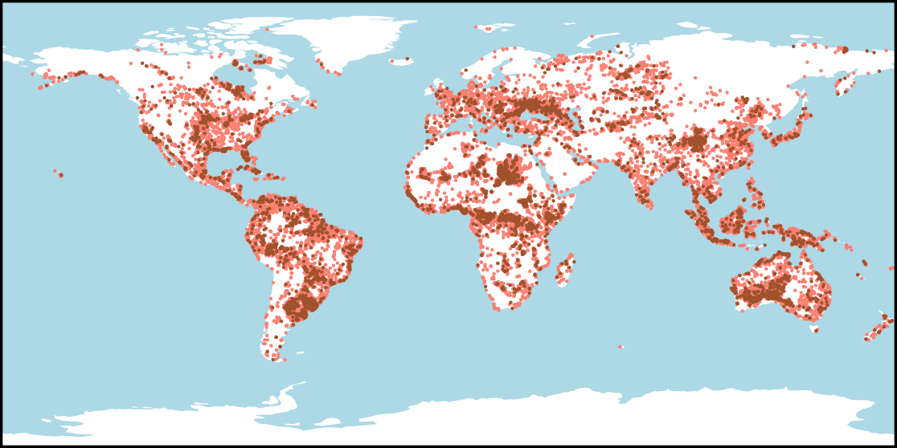

# AllClear

[Hangyu Zhou](https://zhou-hangyu.github.io/), [Chia-Hsiang Kao](https://iandrover.github.io), [Cheng Perng Phoo](https://cpphoo.github.io), [Utkarsh Mall](https://www.cs.columbia.edu/~utkarshm/), [Bharath Hariharan](https://www.cs.cornell.edu/~bharathh/), [Kavita Bala](http://www.cs.cornell.edu/~kb/)

[](https://arxiv.org/abs/2410.23891)
[](https://allclear.cs.cornell.edu)

`AllClear` is a comprehensive dataset/benchmark for cloud detection and removal. 

**Notice:** We are actively cleaning up the codebase and uploading our dataset for public access. Stay tuned!



## Setup
<!-- `AllClear` comes with minimal package requirements. It can be easily installed using pip. 
Please navigate to the root directory of this project and run the following commands:

```bash
pip install -e .
``` -->

Please navigate to the root directory of this project and run the following commands:
```bash
# Clone the repository
git clone https://github.com/Zhou-Hangyu/allclear.git

# Obtain the baselines
cd allclear
git submodule update --init --recursive

# Download the dataset and metadata json file.
python download.py
```

## Benchmark Usage

This section provides instructions on how to use the benchmark with the `UnCRtainTS` model as an example.

1. First, set up the environment for `UnCRtainTS`. Visit the [UnCRtainTS GitHub page](https://github.com/PatrickTUM/UnCRtainTS) and follow the instructions there to create their conda environment.

2. After setting up the `UnCRtainTS` environment, navigate to the root directory of this project and install our package using pip:

    ```bash
    pip install -e .
    ```

3. To run the benchmark and see some results, execute the `run_benchmark.sh` script located in the `demos` directory:

    ```bash
    # Run the Least Cloudy baseline
    bash demos/run_benchmark_leastcloud.sh 

    # Run the pretrained UnCRtainTS
    bash demos/run_uncrtaints_pretrained.sh 

    # Run the UnCRtainTS pretrained on our full allclear dataset 
    bash demos/run_uncrtaints_allclear100pc.sh 
    ```

## Notes
* We use [Cloud Optimized GeoTIFF (COG)](http://cogeo.org/) format to store all our GeoTIFF files.
* The raw data comes with gaps (NaN values) around the boundaries due to map projection. 
We currently center-crop the images on the fly to get rid of the gaps.
We are working on post-processing the entire dataset to crop them for good.

## TODOs
* Add dataset construction packages to the environment.

## License

This project is licensed under the [MIT License](LICENSE).


## Internal Notes (for developers)
* The main package folder is `allclear`. Should only contain reusable code directly related to the use of the dataset and benchmark.
* Every baseline we proposed or reproduced should have one folder in the `/baselines` folder.
  * They will have a wrapper in `allclear/baselines.py` with uniform input/output format for easy comparison.
* The `demo` folder contains minimal code to demonstrate the use of the dataset and benchmark.
* For all other code, please put them in the `/experimental_scripts` folder for now.
